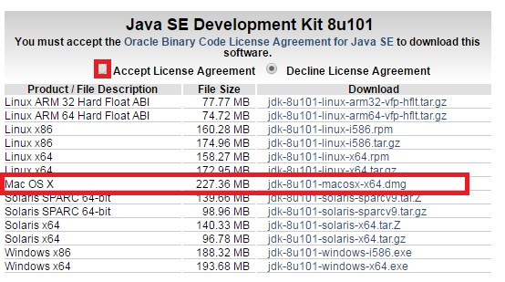
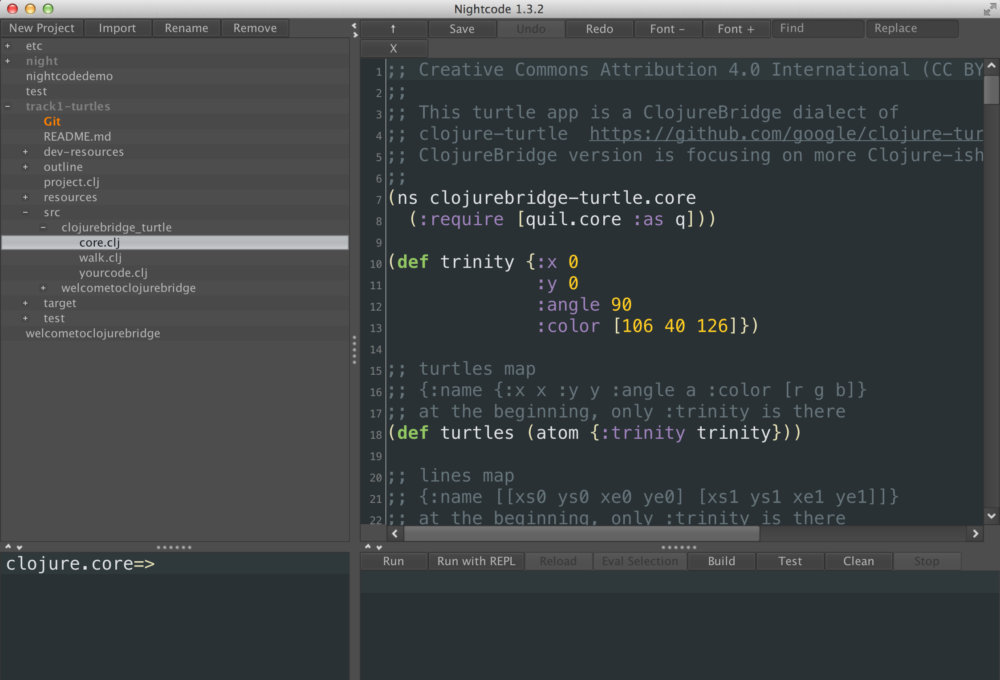

OS X Setup
==========

* Install Java 
* Get Nightcode installed
* Test installation

<!--
## Starting a terminal

For these instructions you will need to have a terminal, or command line, open. This is a text-based interface to talk to your computer, and you can open it by running Terminal.app, which is found under `/Applications/Utilities`. If you have never used the terminal before, you may want to spend some time [reading up on command-line basics](http://blog.teamtreehouse.com/command-line-basics).

Go ahead and open your terminal now. It should look something like this:

The prompt (where you will type your commands) may look different: it usually shows the computer name and user name, as well as the folder or directory you are currently in.

For the rest of this setup, I will tell you to run commands in your terminal. When I say that, I mean "type the command into the terminal and press the Return key."

## Making sure Java is installed

Run `java -version` in your terminal. If you do not have Java installed, OS X will prompt you to install it. Follow all of the directions OS X gives you, then return to this part of the tutorial and run `java -version` again.

If Java is installed, you will see something like this in your terminal:

The details of Java's version may differ from what you see above; that is perfectly fine. If the command line tells says something like `command not found` that means you don't have java installed. Go [here](http://www.oracle.com/technetwork/java/javase/downloads/index.html) and click **JDK Download** to install the java development environment
-->

## Installing Java
Go to [Oracle Java Development Kit (JDK) 8 download site](http://www.oracle.com/technetwork/java/javase/downloads/jdk8-downloads-2133151.html).  You should see a screen with various download options. Accept the license agreement and select Mac OS X:

## Installing Nightcode

Nightcode is a Clojure IDE (Integrated Development Environment, which means that it is a text editor, like Word, only specialized for writing programs) that comes bundled with other tools useful for 
working with Clojure. 

Note that we will be using Nightcode **1.3.2**, not any of the later versions of Nightcode. 

To download and install Nightcode 1.3.2, go to [https://github.com/oakes/Nightcode/releases/tag/1.3.2](https://github.com/oakes/Nightcode/releases/tag/1.3.2). 
Under Downloads, click on **nightcode-1.3.2-standalone.jar**. 
Once it downloads, you might want to drag it into your `Programs` folder or any other place where it would be convenient to access it later (you also might want to create a folder for Clojure work and put it there). 
After you move it, double-click on it to start. 

You may get a message indicating that this type of files may be harmful for your computer and asking you if you still would like to run it. Allow running it. If you get a message that the firewall has blocked some of its features, click "allow access". 

Once Nightcode is successfully installed, it will start and look like the picture above (only without all the code).

Now follow to instructions for your track to get the Clojure project you will be working on: 

- [Track 1: turtles](setup_track1.md).
- [Track 2: Clojure koans](setup_track2.md). 
