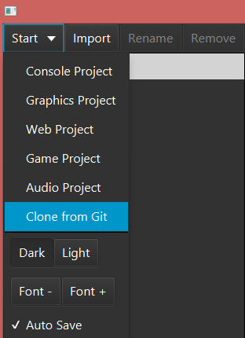
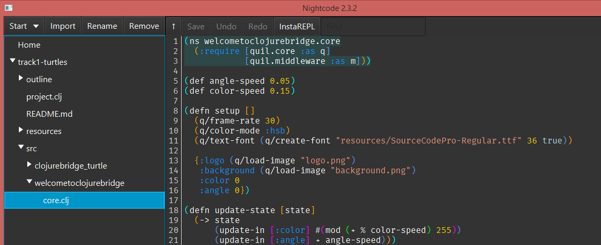
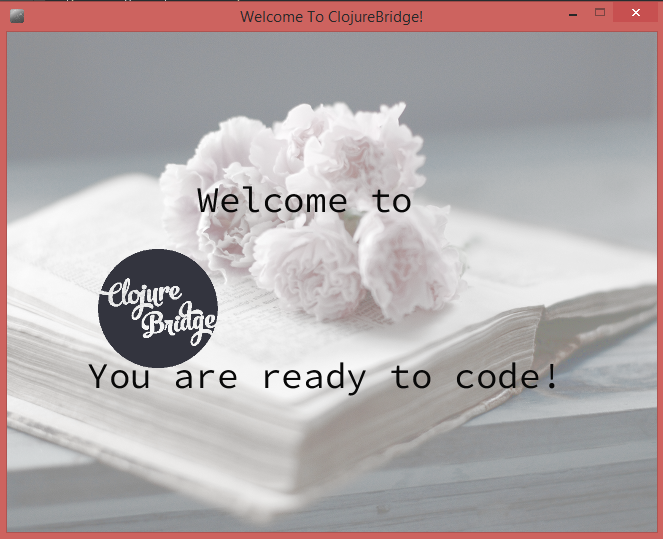

Installfest: Getting Track 1 project
===========================

# Getting the Track 1 project: turtles. 

## Cloning a turtles project from a git repository

Git is a neat tool that is sort of like dropbox for code. It allows many people to collaborate on projects and make their code open to the rest of the world! We have prepared some code for that will run the lessons you will be using. The process of getting this code is called *cloning* and Nightcode has some nice tools that makes that process super easy! You will need to open NightCode and follow these instructions:

1. Go to Start menu, select "Clone from Git": . 
2. It will open a window asking for `git address`. Copy this address `https://github.com/clojurebridge-boston/track1-turtles.git` and press `enter`.
3. You will be asked to select a folder location for your project. You can use an existing folder or create a new one. 
4. You will see a message "Cloning". Once the project is cloned, it will open in the left navigation bar of Nightcode, as shown in the next section. 

That should be it!

## Verifying that your project works

You can click on arrows to open folders, and double-click on files to open them in Nightcode: 
Click on the arrow by `src` to open the folder, then click on the arrow by  `welcometoclojurebridge`. Click on the file `core.clj`, it should be highlighted, as shown above.   

Above the lower right panel press "Run with REPL" button, and then "Reload". You should see a nice picture welcoming you to ClojureBridge:

If you see it -- congratulations, you are ready for Saturday coding! If you are running into any issues or have questions, please ask a mentor (in person, on slack, or by email, depending on where you are working on the installation). 

