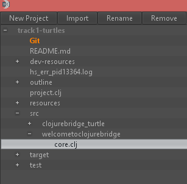

Installfest: Getting Track 1 project
===========================

# Getting the Track 1 project: turtles. 

## Cloning a turtles project from a git repository

git is a neat tool that is sort of like dropbox for code. It allows many people to collaborate on projects and make their code open to the rest of the world! We have prepared some code for that will run the lessons you will be using. The process of getting this code is called *cloning* and Nightcode has some nice tools that makes that process super easy! You will need to open NightCode and follow these instructions. 

 1. Click `New Project`
 2. Select a folder location for your project, type in your project name (say CBB) in the `File Name` form and click `Save`.
 3. On the `Specify Project Type` screen, click `Download`. 
 4. Type in `https://github.com/clojurebridge-boston/track1-turtles.git` where it says `git address`.
 5. Press enter to get the project. 

That should be it!

## Verifying that your project works

You will see your project files in the upper left Nightcode panel. Click on the + by `src` to open it, then click on the + by `welcometoclojurebridge`. Click on the file `core.clj`, it should be highlighted: 

Above the lower right panel press "Run with REPL" button, and then "Reload". You should see a nice picture welcoming you to ClojureBridge:

If you see it -- congratulations, you are ready for Saturday coding! If you are running into any issues or have questions, please ask a mentor. 

